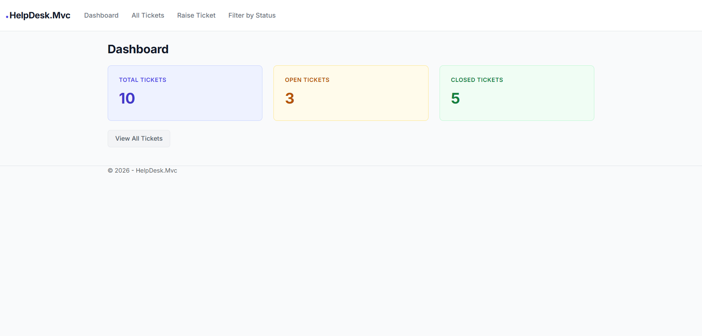
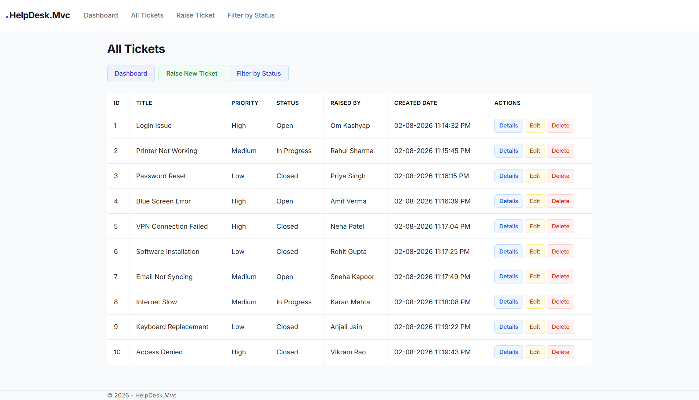
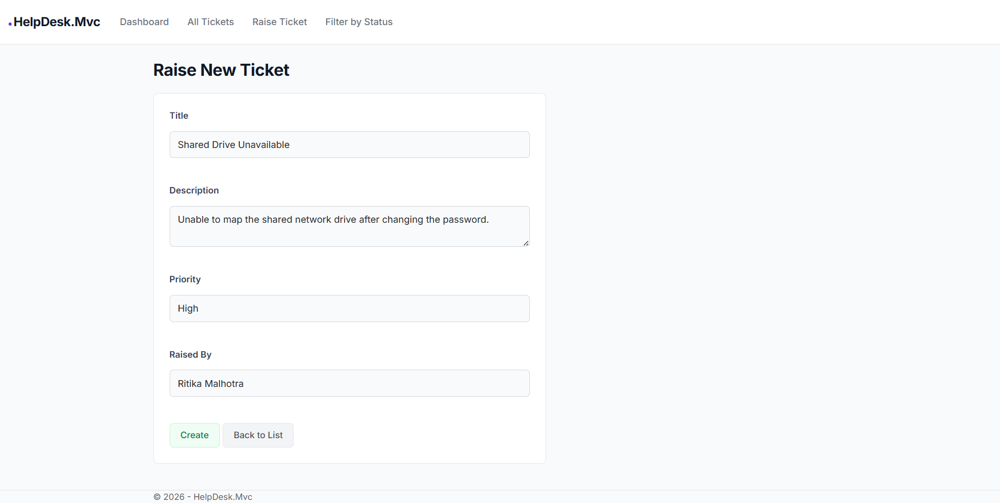
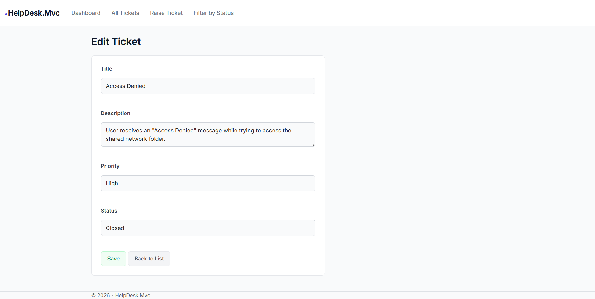
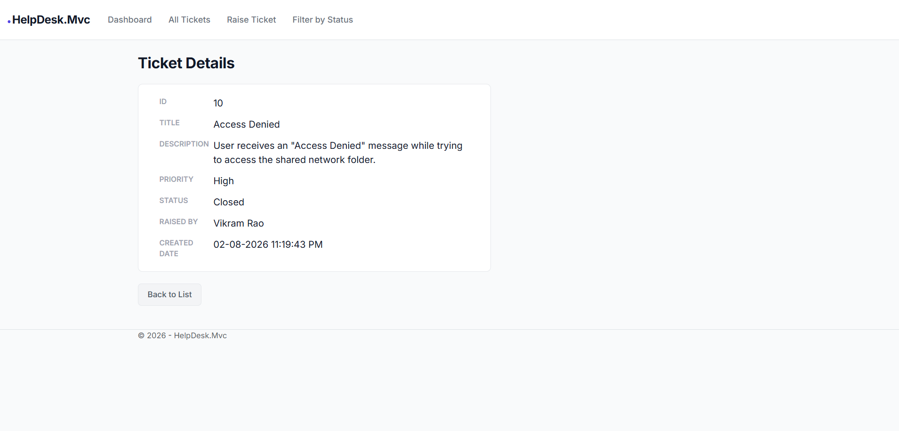
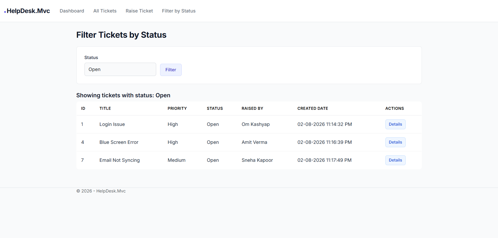

# HelpDeskManagement

Help Desk Ticket Management System built using ASP.NET Core Web API, ASP.NET Core MVC, Entity Framework Core, SQL Server, xUnit, Moq and GitHub.

## Project Structure

- **HelpDesk.Api** — ASP.NET Core Web API implementing the Repository Pattern with Entity Framework Core and SQL Server.
- **HelpDesk.Mvc** — ASP.NET Core MVC application that consumes the Web API through a Service Layer.
- **HelpDesk.Tests** — xUnit test project with Moq-based unit tests for the controller.

## Features

- Dashboard showing Total, Open, and Closed tickets
- View all tickets
- View ticket details
- Raise new ticket (status hardcoded as Open)
- Edit ticket (Title, Description, Priority, Status)
- Delete ticket
- Filter tickets by status

## Tech Stack

- ASP.NET Core Web API
- ASP.NET Core MVC
- Entity Framework Core
- SQL Server (LocalDB)
- xUnit
- Moq

## Getting Started

1. Clone the repository
2. Open `HelpDeskManagement.slnx` in Visual Studio
3. Update the connection string in `HelpDesk.Api/appsettings.json` if needed
4. Run `dotnet ef database update` inside the `HelpDesk.Api` folder to create the database
5. Run both `HelpDesk.Api` and `HelpDesk.Mvc` projects (multiple startup projects)
6. Navigate to the root URL to see the Dashboard

## Screenshots

### Dashboard

### All Tickets

### Raise New Ticket

### Edit Ticket

### Ticket Details

### Filter by Status

